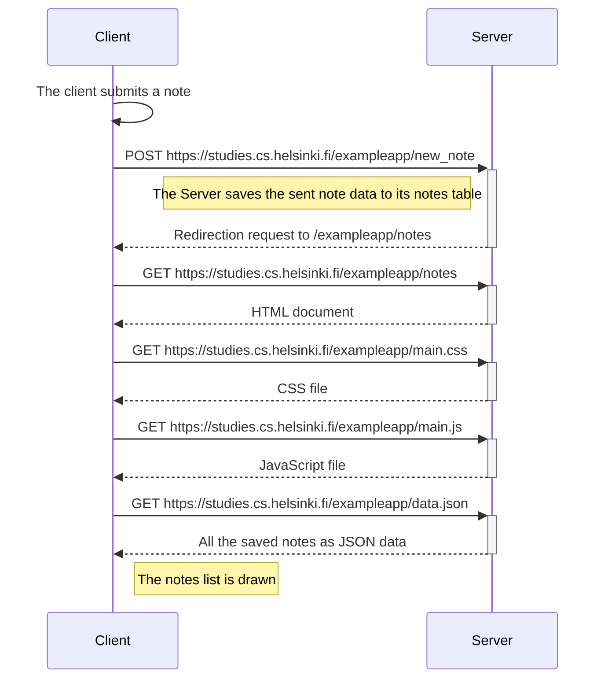

```mermaid
sequenceDiagram
    participant Client
    participant Server

    Client->>Client: The client submits a note
    Client->>+Server: POST https://studies.cs.helsinki.fi/exampleapp/new_note
    note left of Server: The Server saves the sent note data to its notes table
    Server-->>-Client: Redirection request to /exampleapp/notes

    Client->>+Server: GET https://studies.cs.helsinki.fi/exampleapp/notes
    Server-->>-Client: HTML document

    Client->>+Server: GET https://studies.cs.helsinki.fi/exampleapp/main.css
    Server-->>-Client: CSS file

    Client->>+Server: GET https://studies.cs.helsinki.fi/exampleapp/main.js
    Server-->>-Client: JavaScript file

    Client->>+Server: GET https://studies.cs.helsinki.fi/exampleapp/data.json
    Server-->>-Client: All the saved notes as JSON data
    note right of Client: The notes list is drawn
```
