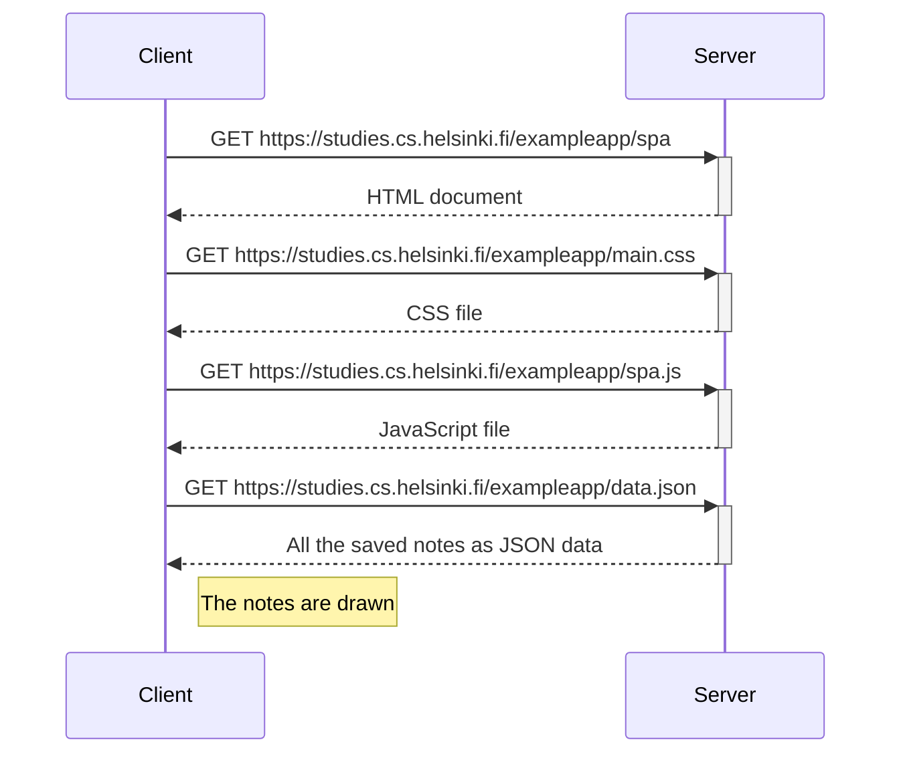

```mermaid
sequenceDiagram
    participant Client
    participant Server

    Client->>+Server: GET https://studies.cs.helsinki.fi/exampleapp/spa
    Server-->>-Client: HTML document

    Client->>+Server: GET https://studies.cs.helsinki.fi/exampleapp/main.css
    Server-->>-Client: CSS file

    Client->>+Server: GET https://studies.cs.helsinki.fi/exampleapp/spa.js
    Server-->>-Client: JavaScript file

    Client->>+Server: GET https://studies.cs.helsinki.fi/exampleapp/data.json
    Server-->>-Client: All the saved notes as JSON data
    note right of Client: The notes are drawn
```
