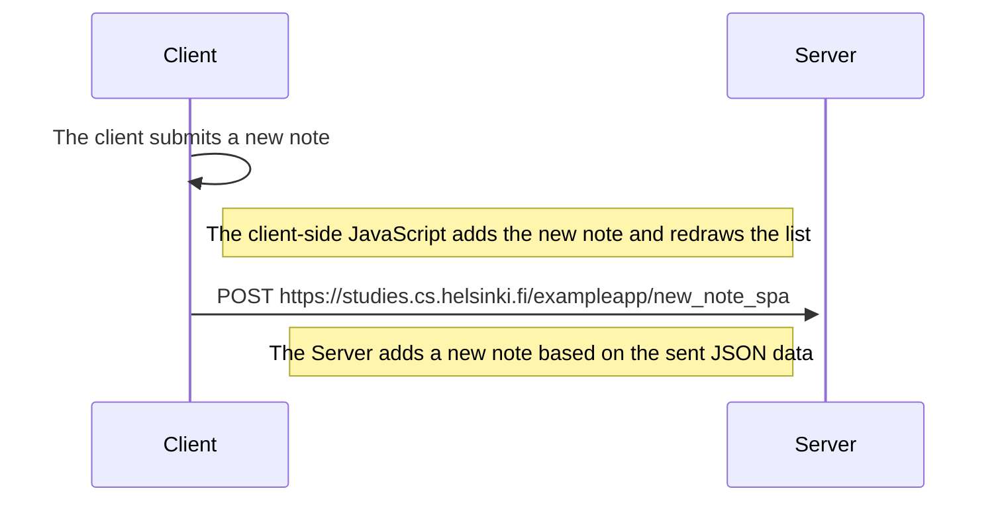

```mermaid
sequenceDiagram
    participant Client
    participant Server

    Client->>Client: The client submits a new note
    note right of Client: The client-side JavaScript adds the new note and redraws the list
    Client->>+Server: POST https://studies.cs.helsinki.fi/exampleapp/new_note_spa
    note left of Server: The Server adds a new note based on the sent JSON data
```
